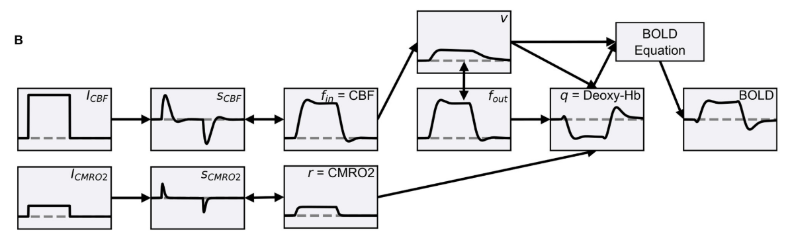

# BalloonLib

[](https://balloonlib.readthedocs.io)
[](LICENSE)
[](https://www.python.org/)
[](https://pytorch.org/)

A Python library for **Hemodynamic Response Function (HRF) reconstruction**
through the Balloon Model (Buxton 1998; Stephan 2007) using
**Physics-Informed Neural Networks (PINNs)**.

## Overview

BalloonLib embeds the Balloon haemodynamic model as a physics constraint
inside a multi-headed neural network, enabling data-driven HRF estimation
from fMRI BOLD signals while respecting physiological dynamics.

**Pipeline** (adapted from Maith et al. 2022):



### Key Features

- **Multi-head PINN architecture** with Fourier feature mapping and
  Random Weight Factorization (RWF)
- **Adaptive loss balancing** (Bischof & Kraus 2021) for stable
  multi-objective training
- **Causal temporal weighting** for sequential ODE learning
- **HRF descriptor extraction** (HP, TTP, FWHM, TO, AUC, MU, TTU, TT0)
- Supports both single-trial and block-design fMRI paradigms

## Installation

```bash
# Clone the repository
git clone https://github.com/errehache/BalloonLib.git
cd BalloonLib

# Install in development mode
pip install -e .

# With development tools (testing, linting)
pip install -e ".[dev]"

# With documentation tools
pip install -e ".[docs]"
```

## Quick Start

```python
import torch
from balloonlib.balloonpinnlib import Multihead, loss, train

# Build the PINN model
model = Multihead(
    n_hidden=64,
    n_layers=4,
    impulse=True,
    dtype=torch.float32,
)

# Train
optimizer = torch.optim.Adam(model.parameters(), lr=1e-3)
loss_trace = train(
    model=model,
    optimizer=optimizer,
    lossfn=loss,
    num_iter=5000,
    Balloon_params=balloon_params,
    data_params=data_params,
    domain=(0, 30),
)
```

For complete working examples, see the notebooks in [`examples/`](examples/).

## Documentation

Full API reference is available at
[balloonlib.readthedocs.io](https://balloonlib.readthedocs.io).

To build the docs locally:

```bash
pip install -e ".[docs]"
cd docs && make html
```

## Project Structure

```
balloonlib/
├── balloonpinnlib.py    # Core PINN model, loss, and training loop
├── balloonmodellib.py   # Balloon model physiological equations
├── plotting.py          # Visualisation utilities
└── rwf_layers.py        # Random Weight Factorization layers
```

## Citation

If you use BalloonLib in your research, please cite:

```bibtex
@software{balloonlib2024,
  author  = {Avaria, Rodrigo H.},
  title   = {BalloonLib: HRF Reconstruction via Physics-Informed Neural Networks},
  year    = {2024},
  url     = {https://github.com/errehache/BalloonLib},
}
```

## License

MIT — see [LICENSE](LICENSE) for details.